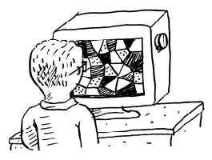

  

    
  

  <h1 align="center">grokking-algorithms-rust</h1>
  <h4 align="center">
    Grokking Algorithms implementations in Rust
  </h4>

  
  
  

# Contents

- [Binary Search](./src/binary_search.rs)
- [Selection Sort](./src/selection_sort.rs)
- [Find Max (Recursive)](./src/find_max_recursive.rs)
- [Sum (Recursive)](./src/sum_recursive.rs)
